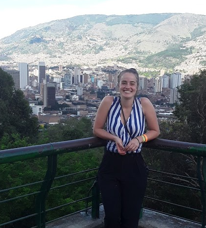

# About Me
I grew up in the beautiful Pacific Northwest, which is where my love of the nature and the outdoors began. In my undergrad at Colorado College, I quickly realized my interest in the intersection of Biology and mathematics. I graduated in 2019 with a degree in Organismal Biology and Ecology and a mathematical biology minor. After working for a few years, I returned to school and am currently getting my Master's in Quantitative Marine Ecology with Dr. Easton White.

## Current Research
Currently, I am pursuing a Master's in Quantitative Marine Ecology under Dr. Easton White at UNH. My research focuses on applying modeling population dynamics and exploring Socio-Ecological systems using mathematcal methods. 

## Publications
Head, M., Cope, J., **Wulfing, S.**. 2020. Applying a flexible spline model to estimate functional maturity 
and spatio-temporal variability in aurora rockfish (_Sebastes aurora_). _Environmental Biology of Fishes_.
[Link](https://link.springer.com/article/10.1007%2Fs10641-020-01014-2)

Cordero Solórzano, R., **Wulfing, S.**, Hernández, G., García-Robledo, C., Molina, R. 2019. Tolerancia 
térmica de las plantas a través de la sensibilidad de la fluorescencia de la clorofila. _Congreso 
Internacional de Ciencias Exactas y Naturales, Universidad Nacional. Costa Rica._

## Past Reasearch Experiences

### University of Nebraska-Lincoln, Lincoln, Nebraska 6/2021 - 8/2021
Here, I aided in the creation of a stiochiometric database by overseeing a group of students doing the background research for the database. I also arranged speakers and programmed weekly seminars to help these undergrads and graduates with their career and scientific skills. Further, I took on an independent project gathering international data and assessing the relationship between DOC, Nitrate, and Phosphorus in aquatic ecosystems and presented an update on my findings at our All-Scientist Symposium.

### Research Assistant at Louisiana Universities Marine Consortium, Cocodrie, Louisiana	1/2020 – 3/2021
Here, I assisted in project that conjoined three different laboratories across the Eastern United States quantifying the methane fluxes using a Los Gatos Gas Analyzer, biomass, and soil and water chemistry of coastal marshland. Further, I aided as necessary in my coworkers’ projects including fieldwork, data management in Excel and R, and running laboratory instruments such as a fluorometer, photometer, and Gas Chromatograph.

### Laboratory Assistant at Instituto de Genética, Bogotá, Colombia	8/2019 – 12/2019
In Bogotá, I aided a Master thesis on the genetic makeup and structure of Turtle Grass (_Thalassia testudinum_) by conducting DNA extractions, Polymerase Chain Reaction (PCR), and multiplex PCR on samples of Turtle Grass from five different islands in the Seaflower Biosphere Reserve in the Caribbean. I then ran statistical analysis for several projects using the R package adegenet.

### Research intern at DAAD RISE Germany, Münster, Germany	5/2018 – 8/2018
Assisted PhD students on a project modeling the greenhouse gas emission of Lake Windsborn Volcanic Eifel Nature Park in Rhineland-Palatinate, Germany by using gas chromatography, photometric measurements, radon measurements, and other water collection methods. I was able to utilize modeling programs such as STELLA and R to compile collected data to make a model of the overall carbon and methane production of Lake Windsborn. Here, I conducted an independent research project observing the emission rates of different forms of sediments to extrapolate these effects on larger lake processes.

### Research Intern at NOAA Fisheries, Seattle WA	5/2017 – 8/2017
My project here analyzed rockfish ovaries using light microscopy and modeled rockfish age distribution along the Pacific Coast using data processing systems such as Microsoft Excel and R and co-authored a paper on this project. I also collected species samples for the FRAM survey for ten days on a fishing vessel to gather data for researchers and set fishing quotas for future commercial fishing seasons.

## Contact me
Email: sophiewulfing@gmail.com

[Twitter](https://twitter.com/SophieWulfing)
